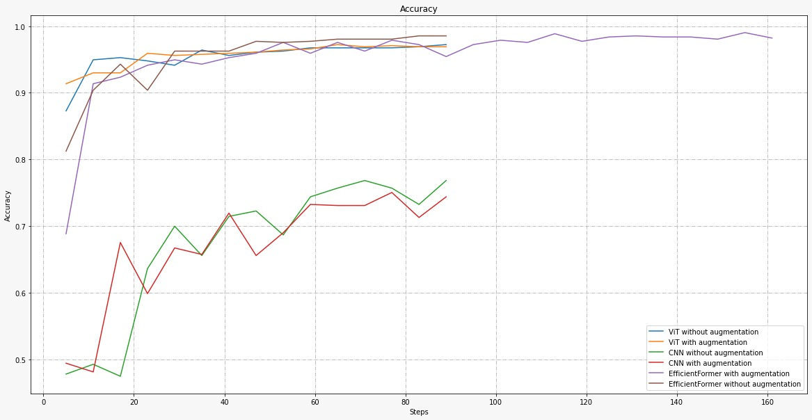
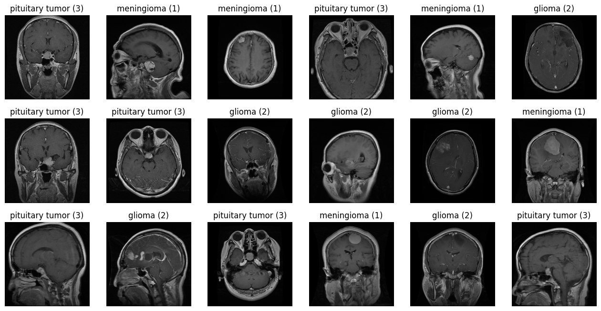

<h1 align="center">
  <br>
BrainSight:Leveraging-Vision Transformers for Tumor Detection
  <br>
</h1>

<p align="center">This project aims to classify brain tumors using a single slice of a T1-weighted contrast MRI scan. We explore the use of the Vision Transformer (ViT) architecture and compare the results against the ResNet-50 architecture and got to accuracy of 99.61% with efficientformer.</p>

<h2 align = "center">
<a target="_blank" href="https://colab.research.google.com/github/litvingil/BrainSight-Leveraging-Vision-Transformers-for-Tumor-Detection/blob/main/BrainSight.ipynb">
  
</a>
</h2>



## Project Introduction

This project is an exploration into the potential of using neural networks for the automation of brain tumor detection and classification, which traditionally relies on the expertise of trained neuroradiologists. We investigate if a neural network, specifically the Vision Transformer (ViT) model, can effectively classify brain tumors using a single slice of a T1-weighted contrast MRI scan.

## Methodology

Our methodology involves using a dataset comprising 3,064 images of three distinct types of brain tumors (Meningioma, Pituitary tumor, and Glioma).



We employ a pre-trained ViT model obtained from Hugging Face and fine-tune it to meet our requirements. We also incorporate data augmentations to improve the robustness and generalization capabilities of our model.

### Technologies Used

- Python
- PyTorch
- Hugging Face Transformers
- Image Processing

### Results

We conduct a comparative analysis between the ViT model and a baseline ResNet-50 model. Our ViT model outperformed the baseline ResNet-50 model in terms of accuracy, achieving 97.23% accuracy without augmentations and 96.90% with augmentations.

## Executing the Project

To get started, you need to install the required libraries. You can do this by running the following commands in a cell, if for instance, you are using Google Colab:

```python
!pip install datasets
!pip install transformers[torch]
!pip install accelerate -U
!pip install wandb
!pip install imgaug
```

Next, you'll need to specify the desired paths in the first cell of your notebook. Additionally, you can alter the initial seed at this step:

```python
seed = 9921378
output_vit_no_aug = '...'
output_vit_no_aug2 = '...'
output_vit_no_aug3 = '...'
output_vit_with_aug = '...'
output_cnn_no_aug = '...'
output_cnn_with_aug = '...'
data_path = '...'
```

Fill in the '...' with the specific paths where you want your output to be stored.

After you've successfully installed the libraries and specified your paths, proceed to run the notebook. Make sure you have all the necessary resources and that your environment is properly set up for the project.

### Load pretrained model

For loading pretrained model use

```python
from transformers import ViTForImageClassification
model = ViTForImageClassification.from_pretrained('path_to_model_dir')
```

## Future Work

Our project has demonstrated the potential for integration into a clinical system, enhancing the diagnostic capabilities of physicians and saving vital time. We aim to further enhance our model by exploring additional variations of ViT and other techniques to boost its accuracy and generalization capabilities.

## Authors

- Omer Paz
- Gil Litvin
- Ari Shemesh
